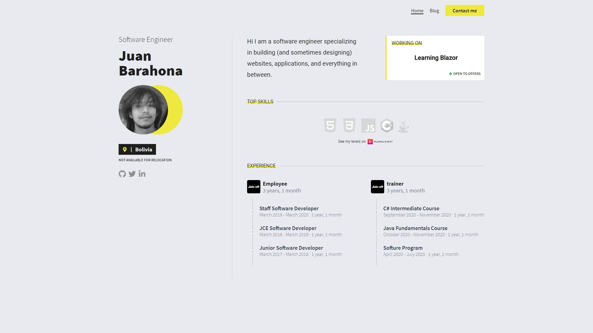

# Registry Theme

Registry is an open source Gatsby theme for developer

## Preview



## 🌠 Usage

> The project is currently in development and what you see in the preview image is what is currently implemented but the theme is not published through npm yet 

To run the project:

1. Clone the repository
2. Run the following commands
    ```
    yarn install
    yarn develop
    ```

    📝 This will start a server where you will be able to see the page


To modify the information of the page:

1. Go to the `📁Site` folder
2. You will see a `📁Content` folder where you can modify any information about the page 

## Credits and references

This theme was inpired by [gatsby-theme-intro](https://github.com/wkocjan/gatsby-theme-intro)
